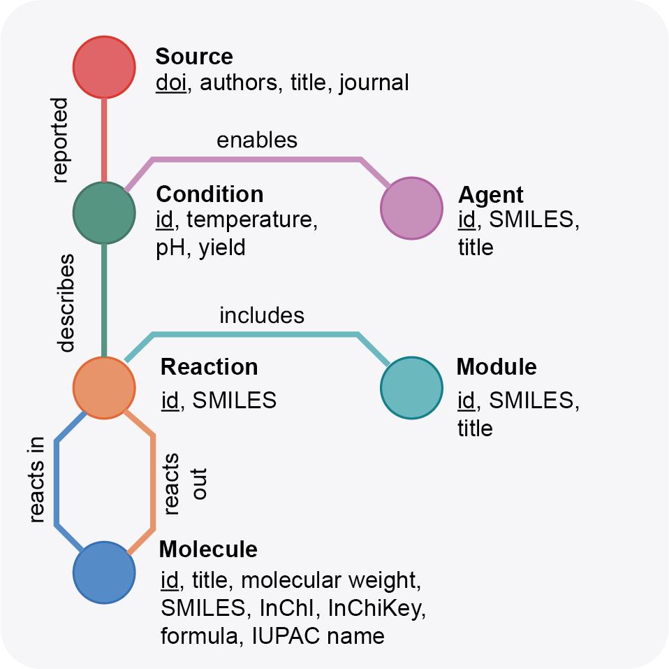

# Navigating ChemOrigins

In this guide, we will visit the fundamental aspects of ChemOrigins
to help you understand how to navigate the database and which information
can you find here.

## ChemOrigins: a network description of prebiotic chemistry

Networks are at the root of this project. Prebiotic chemistry probably enabled some
sort of network of chemical reactions that enabled the synthesis of precursors upon which
life is based. Therefore, the whole database is actually a network. As we are not only
dealing with reactions or chemicals but also with conditions (e.g. which temperature?)
or sources (e.g. who published this data?), ChemOrigins extends the idea of the network
of chemical reactions to a graph of knowledge, where:

- Reactions connect molecules, which might be sources or products.
- Reactions are enabled by specific conditions (e.g. hydrothermal-like environments).
- Conditions might require agents (e.g. UV light, ferrous iron).
- Conditions have been described in the literature. 
- Reactions might have been compiled in modules.

This knowledge graph is not complete (that means, you can connect every kind of node with
other nodes), but this is intentional. ChemOrigins aims to enable with this treatment the
most accurate treatment of prebiotic chemistry. For instance, it is not possible to find
reactions that have not been linked to a specific article through the conditions nodes. 

## The fundamental unit: the annotation

ChemOrigins is based on literature annotations. This means:

1. There has been some result that became published.
2. Somebody took the time to write down an annotation describing the different
processes described in that published work.
3. An annotation was created and uploaded to the database repo.
4. (Possibly) There was a debate about some of the annotations, which were curated to
improve the quality of annotation.
5. The annotation was processed to become the result that you can visit in
ChemOrigins.

If you are interested in uploading and curating annotations, we have a docs page that
will enable to do so. Otherwise, all you need to know is that the database is
built from the labour of the community, and they are subject to change and improvement.

## Interacting with the database

ChemOrigins provides two main ways to access the database:
- The user interface, which is you can access with your browser.
- The API interface, that you can access using a REST interface.

The first case might be the preferred one if your goal is to learn about prebiotic chemistry
or to make a few queries. In the case that you need to automatize any information retrieval, 
the API is a better option. We provide specific docs to interact with the API. **The project
is early and the server deployment is still experimental, so please, be gentle with the API**.

From now on, we will focus on the user interface.

## Searching in the database

Searching is the most straightforward way of connecting with the database. We provide
three search methods.

- **Classical search**. Is the search bar that you find when you access ChemOrigins.
- **Expansion search**. It is a specific method to search for prebiotic chemical reactions and
molecules, see explanation below.
- **Modules**. Modules are a list of curated sets of chemical reactions (e.g. the reactions
leading to the synthesis of a specific residue).

Let's explore each of these by separate.

### Classical search

This method allows either:

- search by regular name. For instance "pyruvate", or "oxazole".
- search by SMILES. For instance "O=CC(=O)O" for pyruvate.
- search by id. For instance "pbm-000034".

In the case of `id`, ChemOrigins uses the following nomenclature:

- Molecules: `pbm-XXXXXX`
- Reactions: `pbr-XXXXXX`
- Agents: `pba-XXXXXX`
- Conditions: `pbc-XXXXXX`

### Expansion

The expansion operator allows to uncover the chemical space spanned by a set of precursors, 
taking into account a set of reactions that can use those. For instance, if we were talking
about cooking, we could say that eggs and milk unlock pancakes. Just that this becomes much
more complicated when we are considering prebiotic chemistry.

We allow the chemical expansion using the search bar in the `expansion` tab, by introducing
the ids of chemicals separated by `.`

For instance:

	pbm-000032.pbm-000124

Note that chemical reaction networks tend to be sparse, so introducing two random molecules
might not produce any outcome.

### Modules

Modules of chemical reactions have been very important to understand processes such as
metabolism. For instance, it is very common to learn the different parts of the metabolism
by pathways (e.g. glycolysis, Krebs-cycle). In prebiotic chemistry, there is not such a consesum,
but we believe that allowing users to create their own modules with their own hypothesis can
be very helpful to learn pathways, pose new hypothesis or simply to make a point. The
`modules` tab has a table with all the modules that can be used for this task.
